# 🕌 Islamic App

A Flutter-based Islamic mobile application that brings prayer times, Qibla direction, Quran, Hadith, Azkar, Duas, stories, radio, videos, Azan audio, local notifications, and phone-number authentication into one application.

## ✨ Features

- 📱 Phone number login with OTP using **Firebase Authentication**
- 🕌 Prayer times based on the user's current location
- 🧭 Qibla direction using location and compass data
- 📖 Quran browsing with Surahs, Ayahs, and audio playback
- 📜 Hadith browsing
- 🤲 Duas organized by categories
- 📿 Azkar and Sebha
- 🕋 Islamic stories
- 📻 Islamic/Quran radio streaming
- 🎬 Islamic video content
- 🔊 Azan audio with selectable reciters
- 🔔 Scheduled **local notifications** for reminders and Azkar/prayer-related events
- 🌙 Dark & Light themes
- 🌐 Arabic & English localization
- 📡 Network awareness and offline/cache support for selected data
- 📐 Responsive layouts for different screen sizes

## 🏗️ Architecture

The project uses a **feature-based structure inspired by Clean Architecture**, with clear separation between Data, Domain, and Presentation responsibilities in the main features.

```text
lib/
├── core/
│   ├── api/
│   ├── constant/
│   ├── di/
│   ├── errors/
│   ├── helper/
│   ├── network/
│   ├── routing/
│   ├── services/
│   ├── theme/
│   └── widgets/
│
└── features/
    ├── auth/
    ├── drawer/
    │   ├── azan/
    │   ├── compass/
    │   ├── doaa/
    │   ├── stories/
    │   ├── times/
    │   ├── videos/
    │   └── zekr/
    ├── home/
    │   ├── ahadeth/
    │   ├── azkar/
    │   ├── quran/
    │   └── radio/
    ├── main/
    └── splash/
```

Typical feature modules are organized as:

```text
feature/
├── data/
├── domain/
└── presentation/
```

## 🧰 Tech Stack

- **Flutter / Dart**
- **BLoC / Cubit** — state management
- **GetIt** — dependency injection
- **Dio** — networking and REST APIs
- **GoRouter** — navigation
- **fpdart** — `Either`-based result handling
- **SharedPreferences** — local preferences/cache
- **Dio Cache Interceptor + Hive Store** — network caching
- **Geolocator + Geocoding** — location services
- **Flutter Compass** — Qibla direction
- **just_audio + just_audio_background** — audio playback
- **flutter_local_notifications** — local notifications
- **Android Alarm Manager Plus** — scheduled background alarms
- **Firebase Authentication** — phone number / OTP authentication
- **Screen Go** — responsive UI utilities

## 🌐 APIs & Data Sources

The application integrates with external services for Islamic content and prayer information, including:

- **AlAdhan API** — prayer times and next-prayer information
- **MP3Quran API** — Quran, radio, and video content
- **Ummah API** — Quran, Hadith, and Duas
- **Local bundled JSON** — Islamic stories

## 🔐 Authentication Flow

The application uses Firebase Phone Authentication with OTP verification.

```text
Phone Number
     ↓
Send OTP
     ↓
Verify OTP
     ↓
Firebase Authentication
     ↓
Authenticated User
```

## 🔔 Notifications & Azan

The application uses local notifications and scheduled Android alarms for reminder-related functionality and Azan scheduling.

> Background Azan/audio behavior should be verified on a physical Android device because background execution and notification behavior can vary by device and Android version.

## 🖼️ Screenshots

### Authentication

| Login | OTP |
|---|---|
| 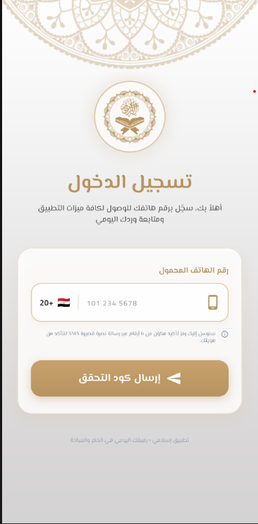 | 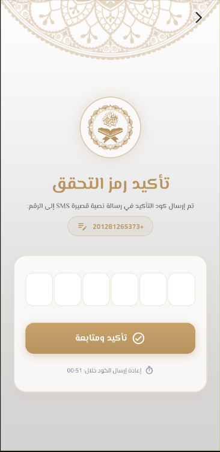 |

### Main Features

| Prayer Times | Qibla |
|---|---|
| 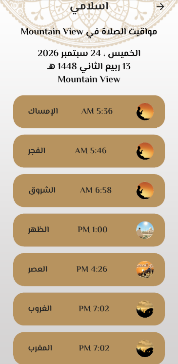 | 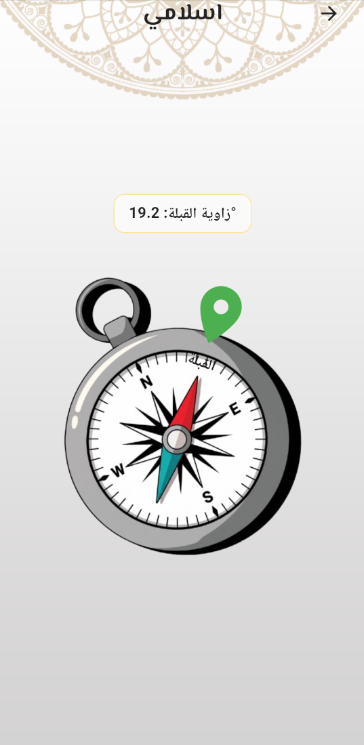 |

### Quran & Hadith — Dark / Light

| Dark | Light |
|---|---|
|  |  |
| 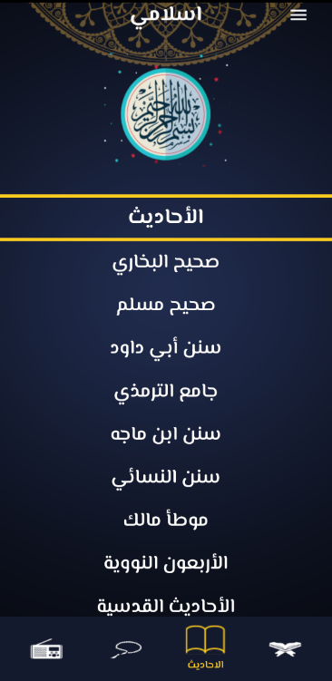 | 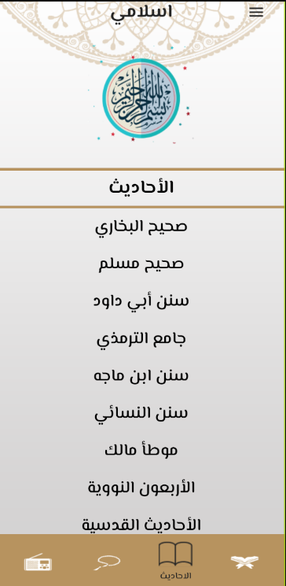 |

### Azkar & Azan — Dark / Light

| Dark | Light |
|---|---|
| 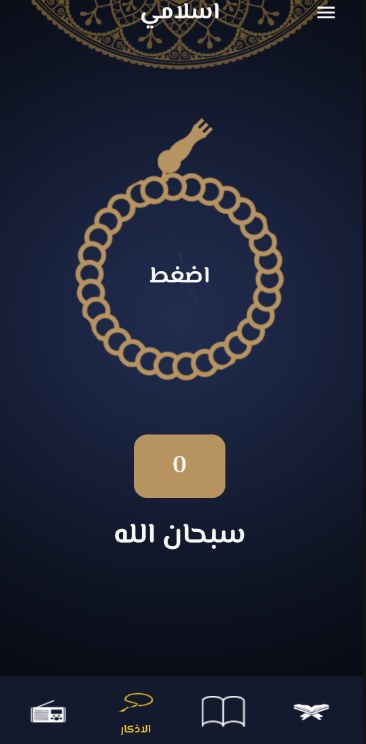 | 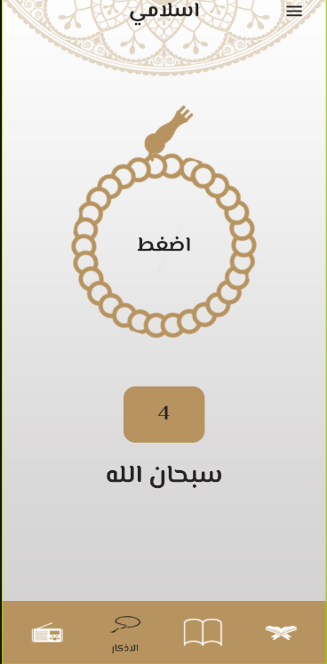 |
| 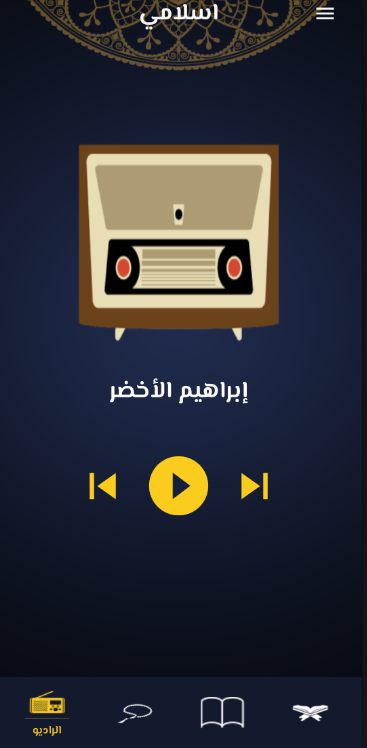 | 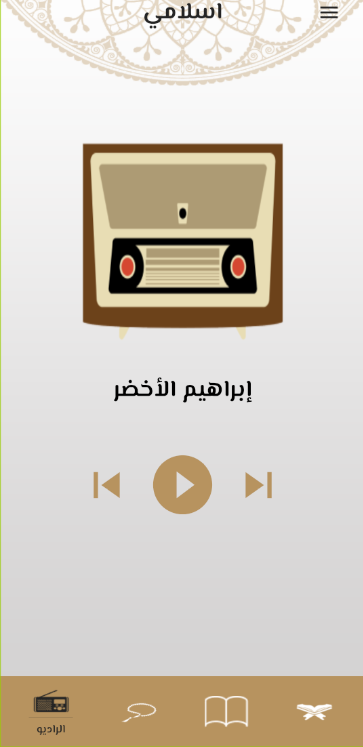 |

### Drawer & Stories

| Dark Drawer | Light Drawer |
|---|---|
| 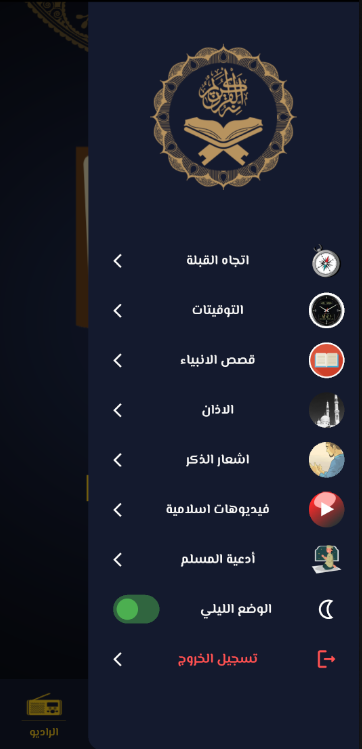 | 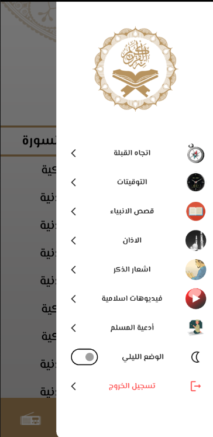 |

| Stories | Story Details |
|---|---|
| 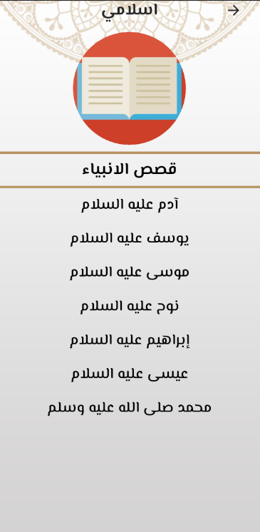 | 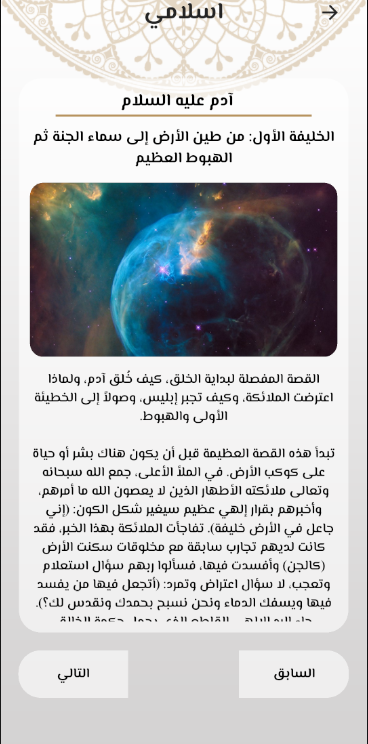 |

| Notify Zekr Light | Notify Zekr Dark |
|---|---|
| 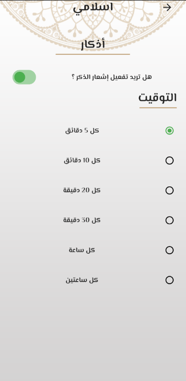 | 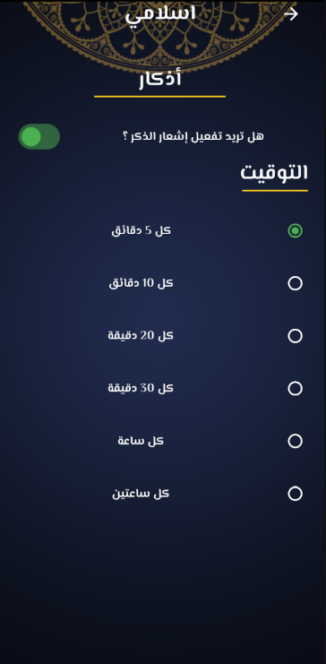 |

## 🚀 Getting Started

### Prerequisites

- Flutter SDK
- Android Studio / VS Code
- Android device or emulator
- Firebase project configured for Phone Authentication

### Installation

```bash
git clone https://github.com/KareemElshnabi2003/Islamic-App.git
cd Islamic-App
flutter pub get
```

### Firebase Configuration

Configure Firebase for the target platform and enable **Phone Authentication** in Firebase Console.

For Android, place the Firebase configuration file here:

```text
android/app/google-services.json
```

Then run:

```bash
flutter run
```

## 📂 Project Highlights

- Feature-based project organization
- Clean separation of presentation, domain, and data concerns
- Centralized dependency injection with GetIt
- API abstraction with Dio
- Error handling with exceptions and `Either`
- Local caching and network awareness
- Location-based prayer and Qibla functionality
- Audio and background scheduling support
- Firebase Phone Authentication

## 👨‍💻 Author

**Kareem Elshnabi**

- GitHub: https://github.com/KareemElshnabi2003
- LinkedIn: https://www.linkedin.com/in/kareem-elshnabi-087624258
